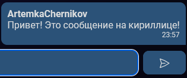
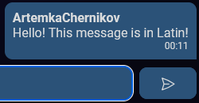
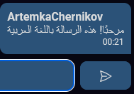

--- 
_Домашнее задание #1_
# Отчёт о тестировании отправки сообщений в мессенджере ChatMe

## Общая информация:
- Дата проведения тестирования: 15.09.2024  
- Платформа: Web  
- Ответственные за тестирование: команда BugHunters  

## Цель тестирования:
Проверка корректности работы функционала отправки сообщений в нашем мессенджере.

## Список проверок:

### 1. Отправка текстовых сообщений

#### Позитивные кейсы:
   1.1. Отправка и получение сообщения на кириллице.  
   - Описание: сообщение на кириллице отправляется и просматривается собеседником корректно.
   - Ожидаемый результат: сообщение отправлено, отображается правильно у собеседника.
   - 

1.2. Отправка сообщения на латинице.  
   - Описание: сообщение на латинице отправляется и просматривается собеседником корректно.
   - Ожидаемый результат: сообщение отправлено, отображается правильно у собеседника.
   - 

1.3. Отправка сообщения на арабском.  
   - Описание: сообщение на арабском языке отправляется и просматривается собеседником корректно.
   - Ожидаемый результат: Сообщение отправлено, отображается правильно у собеседника.
   - 

1.4. Отправка сообщения на китайском.  
   - Описание: Проверяем, что сообщение на китайском языке отправляется корректно.
   - Ожидаемый результат: Сообщение отправлено, отображается правильно у собеседника.
   - 

1.5. Отправка сообщения с использованием специальных символов.  
   - Описание: Проверяем отправку сообщения с различными символами (@, #, &, и т.д.).
   - Ожидаемый результат: Сообщение отправлено, все символы отображаются корректно.
   - 

1.6. Отправка сообщения максимальной допустимой длины.  
   - Описание: Проверяем, что сообщение максимальной длины отправляется корректно.
   - Ожидаемый результат: Сообщение отправлено и отображается целиком у собеседника.
   - 

1.7. Отправка сообщения с использованием эмодзи.  
   - Описание: Проверяем, что сообщение с эмодзи отправляется корректно.
   - Ожидаемый результат: Сообщение отправлено, все эмодзи отображаются корректно.
   - 

#### Негативные кейсы:
   1.8. Отправка пустого сообщения.  
       - Ожидаемый результат: сообщение не отправляется.  
   1.9. Отправка сообщения, превышающего максимальную допустимую длину.  
       - Ожидаемый результат: сообщение не отправляется, выводится уведомление о превышении лимита или дробится на части.  

### 2. Отправка мультимедийных сообщений

#### Позитивные кейсы:
   2.1. Отправка изображения (png, jpg, gif).  
   2.2. Отправка видео (mp4, avi).  
   2.3. Отправка аудиофайлов (mp3).  

#### Негативные кейсы:
   2.4. Отправка файла, превышающего допустимый размер.  
       - Ожидаемый результат: сообщение не отправляется, выводится уведомление о превышении размера файла.  
   2.5. Отправка файла неподдерживаемого формата.  
       - Ожидаемый результат: сообщение не отправляется, выводится уведомление о неподдерживаемом формате.  

### 3. Работа с черновиками

#### Позитивные кейсы:
   3.1. Сохранение неотправленного текстового сообщения после отправки сообщения другому контакту.  
   3.2. Отправка черновика.  

### 4. Отправка сообщений с использованием разных интерфейсов

#### Позитивные кейсы:
   4.1. Отправка сообщения через клавиатуру (кнопка "Enter").  
   4.2. Отправка сообщения через кнопку "Отправить" в UI.  

### 5. Взаимодействие с UI-элементами

#### Позитивные кейсы:
   5.1. Отображение текста сообщения в поле ввода.  
   5.2. Корректное изменение размера поля ввода при добавлении длинного текста.  
   5.3. Отображение смайликов/эмодзи в области отправки.  
   5.4. Удаление текста из поля ввода.  
